<div align="center">
    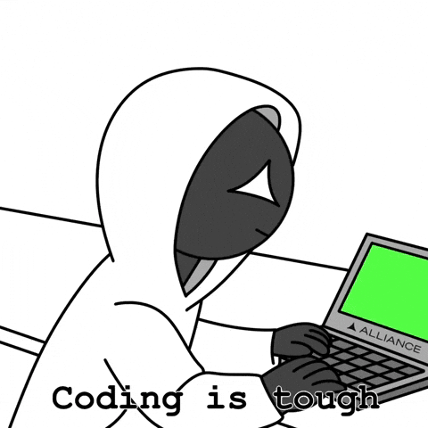
    <br/>
    <br/>
    <a href="https://git.io/typing-svg"></a>
</div>

<div align="center">
    <a href="https://alimaher.netlify.app/"></a>
    <a href="https://linkedin.com/in/alimahershahin"></a>
    <a href="https://www.upwork.com/freelancers/~01db034f0733702a70"></a>
    <a href="https://khamsat.com/user/ali_maher1345"></a>
    <br>
    <a href="https://ko-fi.com/zodiac007"></a>
    <a href="https://buymeacoffee.com/alimaherr4t"></a>
</div>

<div align="center">
    
</div>

## 👨‍💻 About Me
[](https://github.com/ZODIAC3al)

I'm a **Full-Stack Developer & Software Engineer** based in Alexandria, Egypt, specializing in creating modern web and mobile applications. My work focuses on delivering high-quality, scalable solutions that combine aesthetic design with solid architecture.

Currently transitioning into advanced backend development with **NestJS**, **.NET Core**, and **Entity Framework**, while mastering **Design Patterns** and **system architecture**. I believe in continuous learning and never standing still — always pushing boundaries and exploring new technologies.

```javascript
const AliMaher = {
    location: "Alexandria, Egypt",
    role: ["Full-Stack Developer", "Software Engineer"],
    education: "B.Sc. Computer Science, Alexandria University (2025, Excellent)",
    languages: {
        proficient: ["TypeScript", "JavaScript"],
        learning: ["C#"]
    },
    stack: {
        frontend: ["React", "Next.js", "React Native", "Framer Motion", "TanStack Query", "Zustand"],
        backend: ["NestJS", "Node.js", ".NET Core", "Entity Framework"],
        databases: ["PostgreSQL", "MongoDB"],
        ai: ["LangChain.js", "OpenAI SDK", "RAG Pipelines", "Qdrant Cloud"],
        devOps: ["Docker", "Redis", "BullMQ", "Socket.io"],
        currentFocus: ["Design Patterns", "System Architecture", "Agentic AI"]
    },
    UI_UX: ["Figma", "DaisyUI", "Tailwind CSS"],
};
```

> [!NOTE]
> I'm actively building **SmartRoadmap**, an AI-powered personalized learning & hiring platform, as the AI integration lead — combining a Next.js/NestJS monorepo with a LangChain.js RAG pipeline over Qdrant Cloud.

## ☕ Support Me
If you'd like to support my work, you can do so here:

<div align="center">
    <a href="https://ko-fi.com/zodiac007"></a>
    <a href="https://buymeacoffee.com/alimaherr4t"></a>
</div>

<details open>
<summary><a name="certificates"></a><h2>⚜️ Significant Certificates</h2></summary>
<div align="center">
<a href="./assets/certificates/ali_maher_ai_engineer_certificate.png">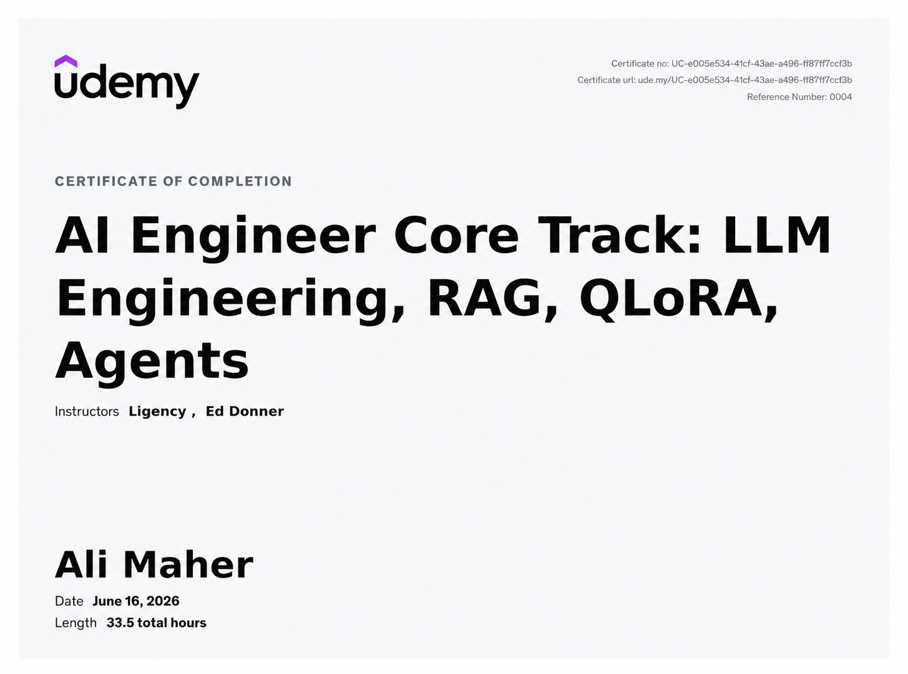</a>
<a href="./assets/certificates/ali_maher_nestjs_certificate1.jpeg">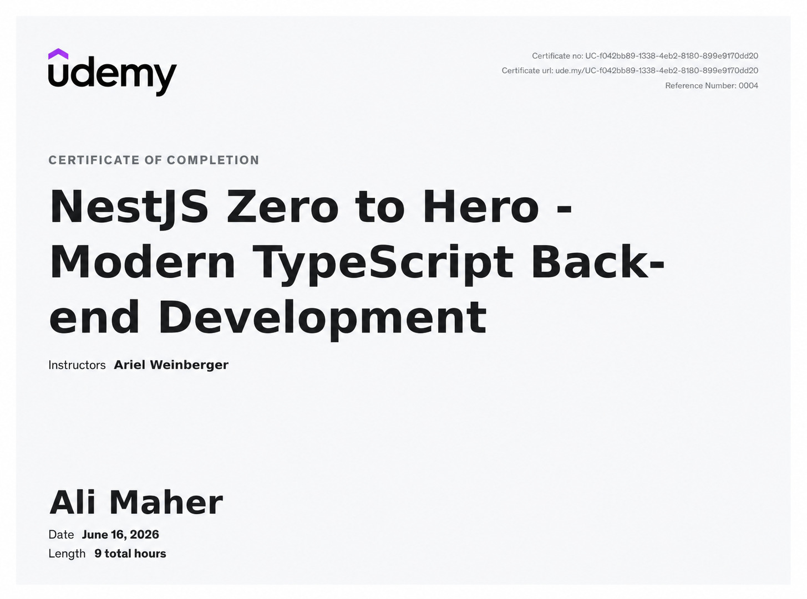</a>
<a href="./assets/certificates/ali_maher_reactjs_certificate.jpeg">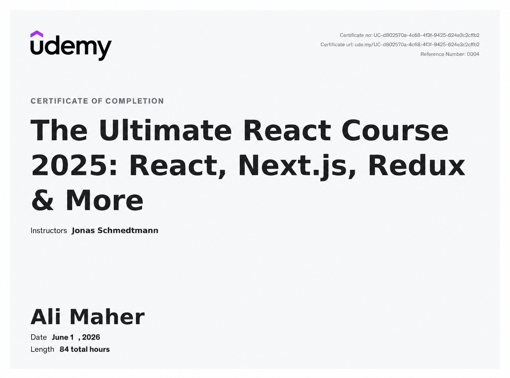</a>
<a href="./assets/certificates/ali_maher_aws_certificate.jpeg">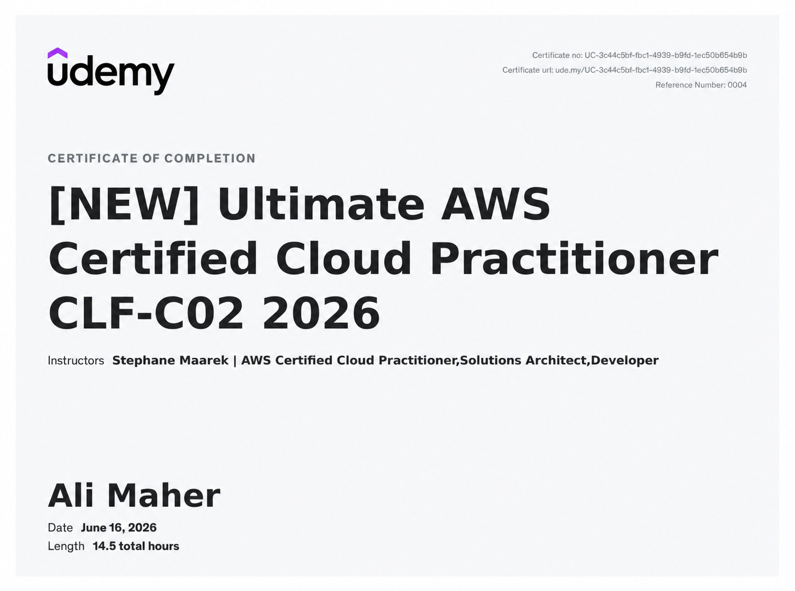</a>
<a href="./assets/certificates/ali_maher_cicd_certificate.jpeg">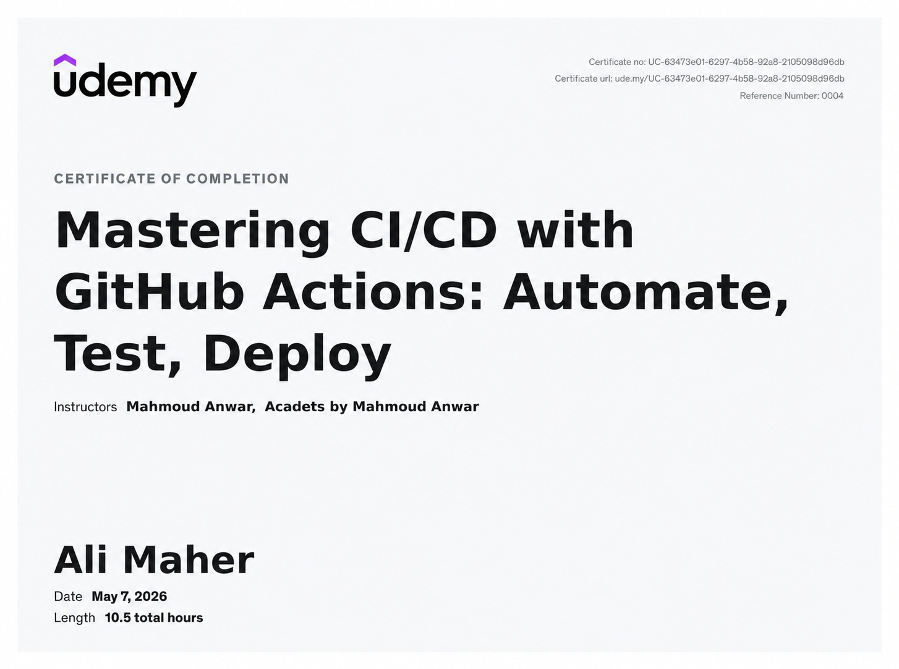</a>
<a href="./assets/certificates/ali_maher_docker_certificate.jpeg">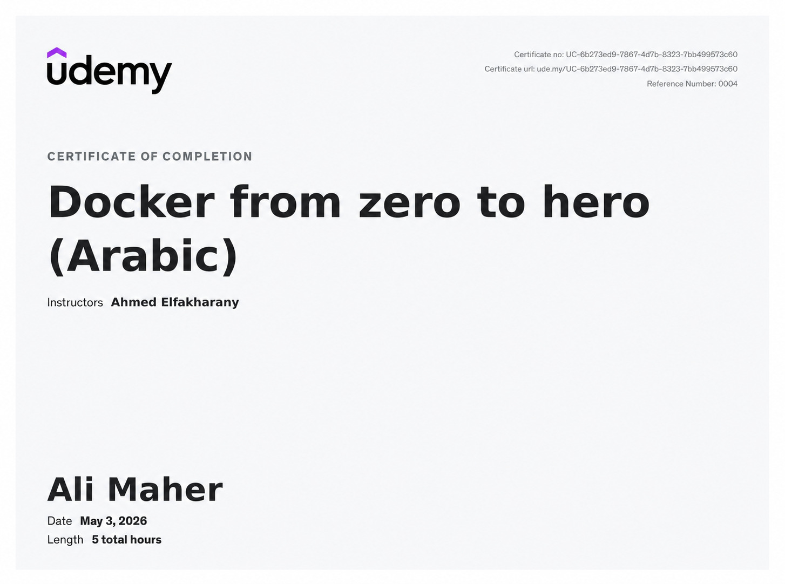</a>
<a href="./assets/certificates/ali_maher_nestjs_certificate.jpeg">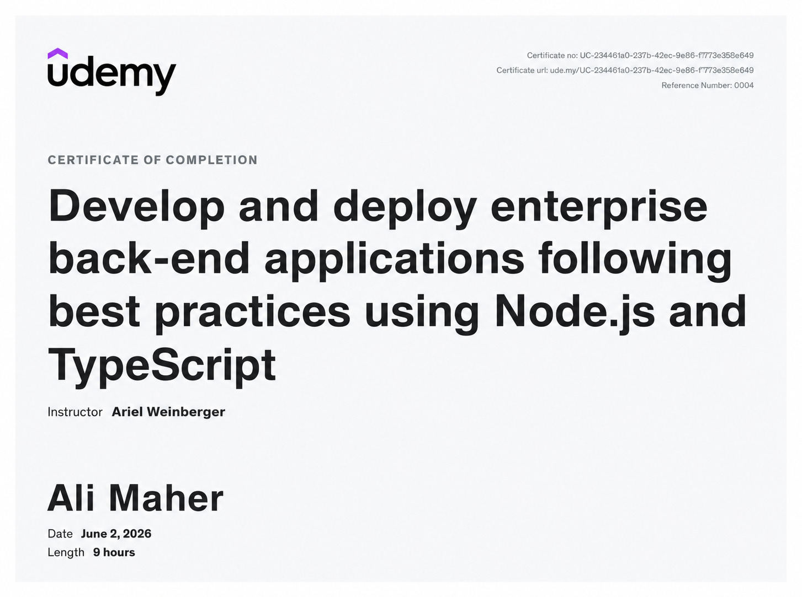</a>
<a href="./assets/certificates/ali_maher_php_certificate.jpeg">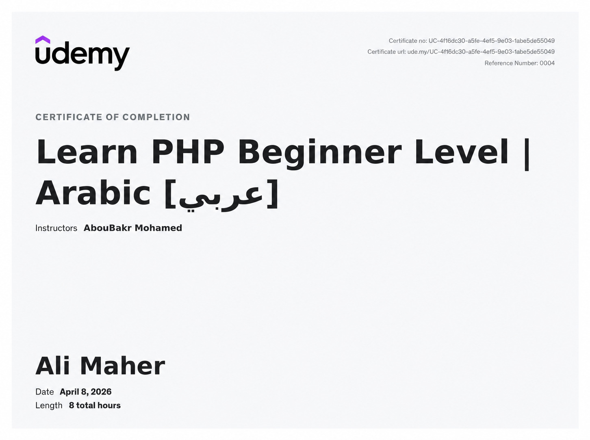</a>
<a href="./assets/certificates/ali_maher_react.jpg">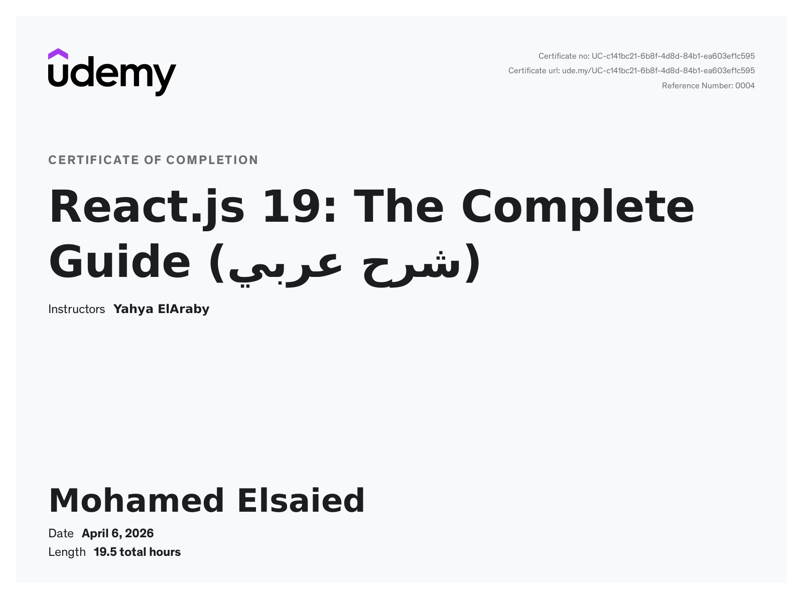</a>
</div>
</details>

<details open>
<summary><h2>🏆 Other Achievements</h2></summary>
<div align="center">
<a href="./assets/achivements/iti_traineeship_excellence_internship.jpg">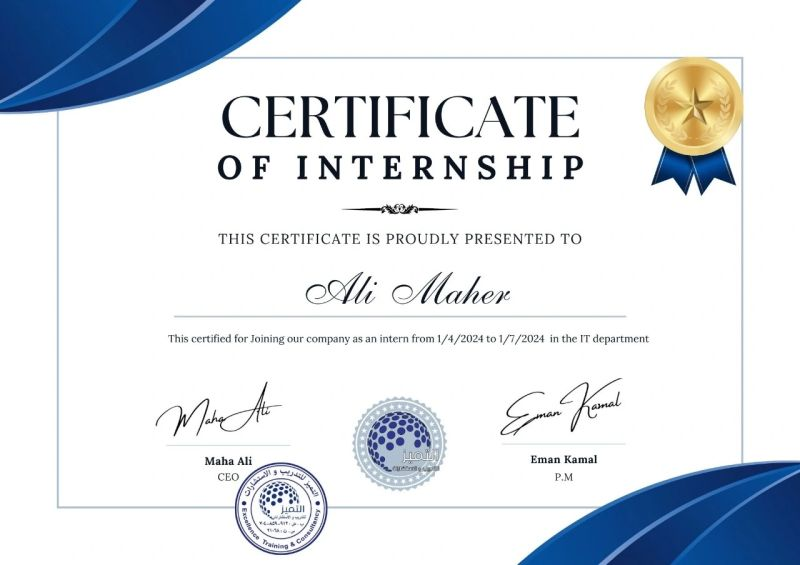</a>
<a href="./assets/achivements/depi_fullstack_dotnet_certificate.jpg">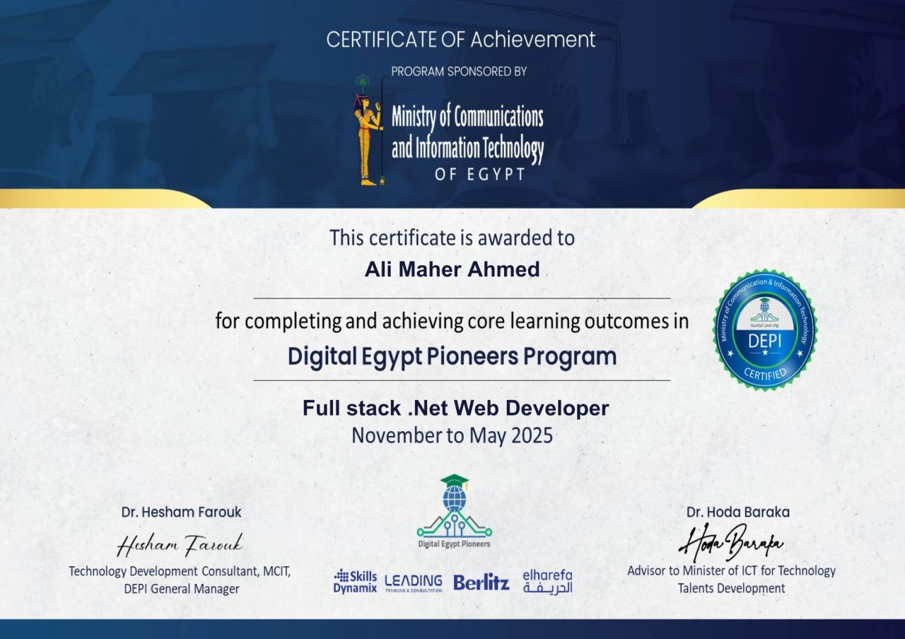</a>
<a href="./assets/achivements/depi_business_english_certificate.jpg">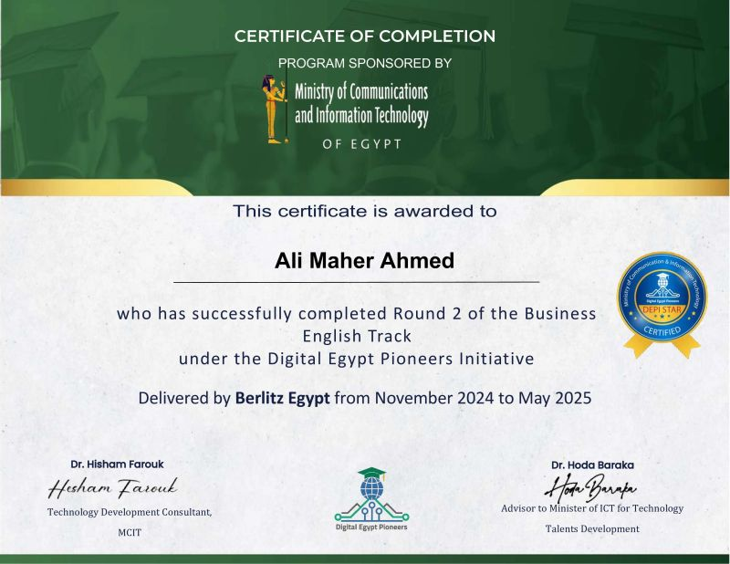</a>
<a href="./assets/achivements/codsoft_internship_certificate.jpg">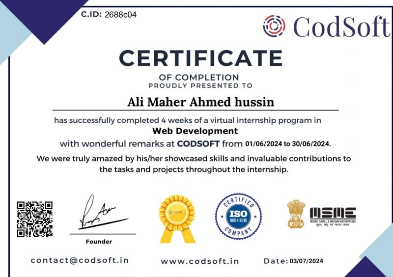</a>
<a href="./assets/achivements/cognorise_internship_certificate.jpg">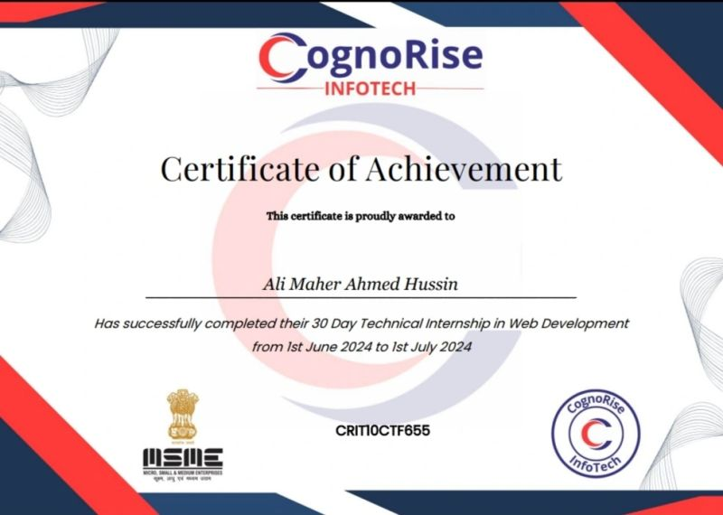</a>
</div>
</details>

<details open>
<summary><h2>📈 Contribution Graph</h2></summary>
<div align="center">

</div>
</details>

<details open>
<summary><h3>📊 Statistics | </h3> </summary>


<div align="center">


</div>
</details>
